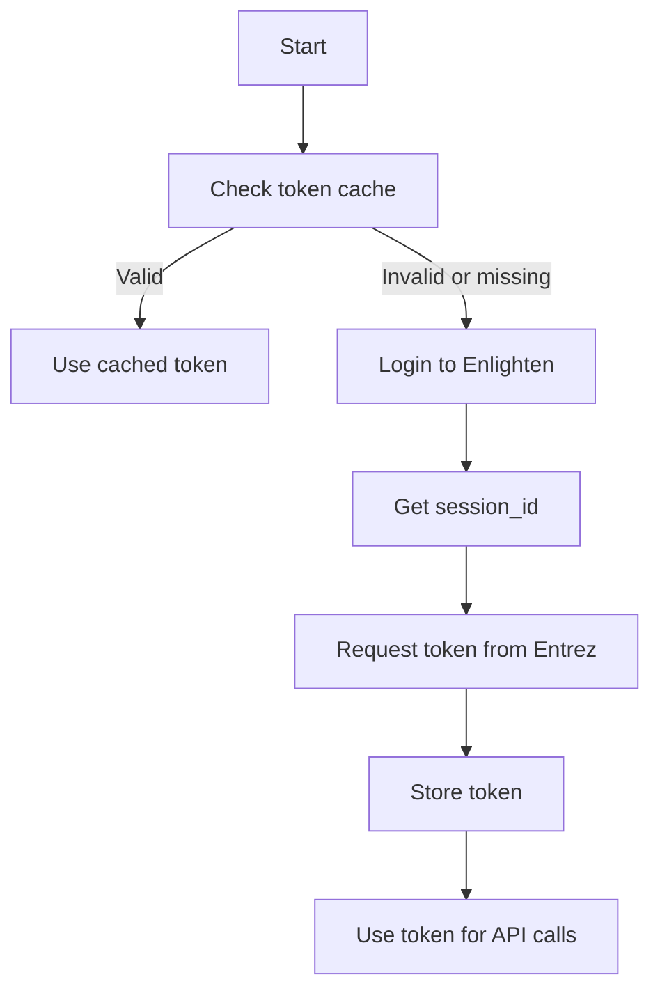
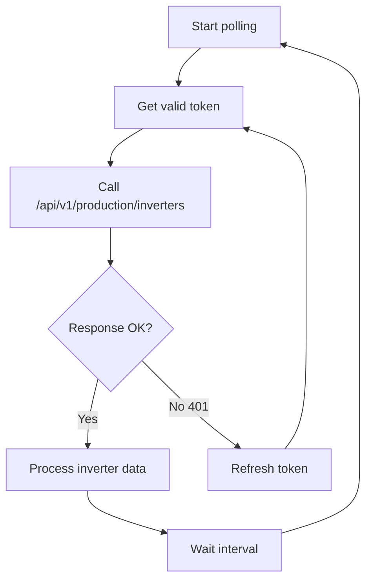

# Authentication Flow

```mermaid
flowchart TD
    A[Start] --> B[Check token cache]
    B -->|Valid| C[Use cached token]
    B -->|Invalid or missing| D[Login to Enlighten]
    D --> E[Get session_id]
    E --> F[Request token from Entrez]
    F --> G[Store token]
    G --> H[Use token for API calls]
```

# Polling Flow

```mermaid
flowchart TD
    A[Start polling] --> B[Get valid token]
    B --> C[Call /api/v1/production/inverters]
    C --> D{Response OK?}
    D -->|Yes| E[Process inverter data]
    D -->|No 401| F[Refresh token]
    F --> B
    E --> G[Wait interval]
    G --> A
```
